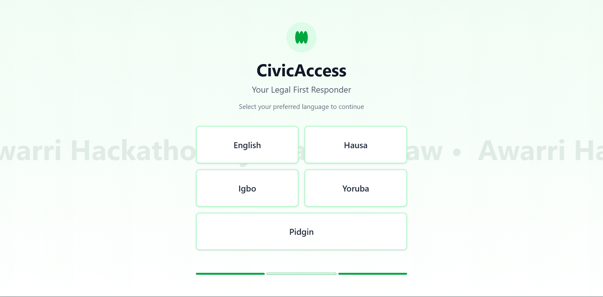
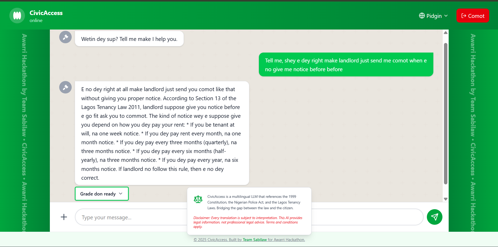
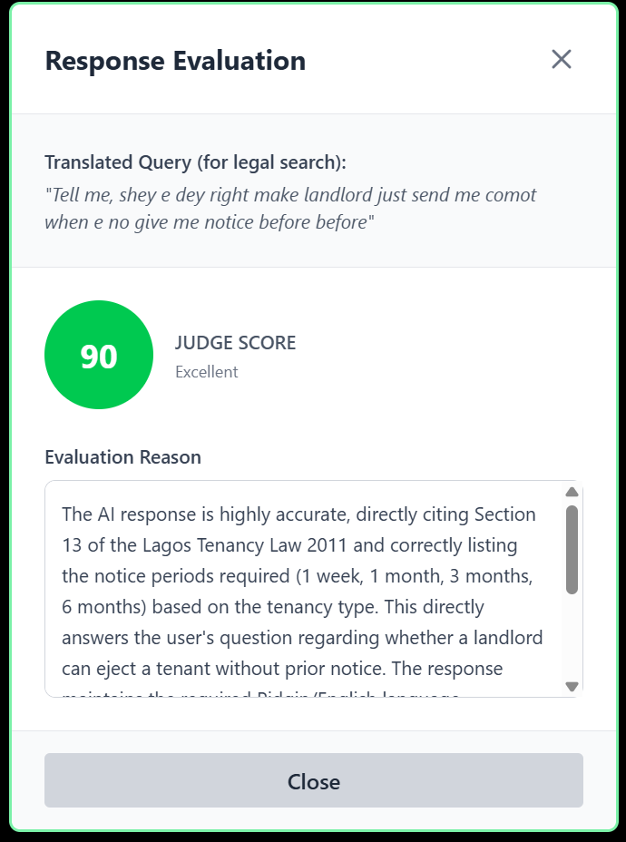

-----

# 🏛️ Civic-Access: Democratizing Legal Knowledge with AI

### *Project by Team SABILAW*


> **🔴 Live Demo:** [https://n-atlas-hackathon.web.app](https://n-atlas-hackathon.web.app)  
> **🧠 Legal Engine API:** `https://civic-backend-528126792252.us-east4.run.app/docs`  
> **📊 Live Evaluation Logs:** `https://civic-backend-528126792252.us-east4.run.app/logs`   
*(Check here to see the "Judge" grading answers in real-time)*  
> **🔐 Auth Engine API:** `https://partner-api-528126792252.us-east4.run.app/`

-----

## 📖 Executive Summary

**Civic Access** is a multi-lingual, AI-powered legal assistant designed to bridge the gap between complex Nigerian laws and everyday citizens.

The Nigerian legal system is written in complex English, effectively excluding millions of citizens who speak Pidgin, Yoruba, Hausa, or Igbo. **Civic Access** solves this by combining **Retrieval-Augmented Generation (RAG)** with a **Hybrid Translation Layer**, allowing users to ask questions like *"Wetin be the law for tiff?"* and receive accurate, legally cited answers in their local dialect.

**Core Resources:**

  * 📜 **1999 Constitution of the Federal Republic of Nigeria (as amended)**
  * 👮 **The Nigeria Police Act 2020**
  * 🏠 **2011 Lagos State Tenancy Laws**

-----

## 🏗️ Microservices Architecture

Civic Access utilizes a decoupled **Microservices Architecture** hosted on **Google Cloud Platform (GCP)** to ensure scalability, fault tolerance, and separation of concerns.

### The Ecosystem

1.  **Frontend (The Face):** A React/Vite SPA hosted on **Firebase Hosting**. It manages the UI, language selection, and routes API calls to the appropriate backend.
2.  **Service A: The Legal Brain (RAG Engine):** A high-performance FastAPI service on **Cloud Run**.
      * **Translation:** Google Cloud Translate (v2) performs query-side translation to English.   *Disclaimer: This pre-processing is required solely to align user intent with our English-based Vector Store for accurate retrieval, distinct from the N-ATLAS model which performs the final generation.*
      * **Retrieval:** ChromaDB + `all-MiniLM-L6-v2` fetches legal chunks.
      * **Reranking:** `cross-encoder/ms-marco-MiniLM-L-6-v2` filters for strict relevance.
      * **Inference:** Uses `NCAIR1/N-ATLaS `multilingual LLM to generate persona-based answers (Street Lawyer, Elder, etc.).
      * **Judge:** `Gemini 2.0 Flash` evaluates answer quality in the background.  *Disclaimer: We only use `GEMINI` to serve the function of LLM as a judge. This is so users of our tool can see the performance of the `N-ATLaS model`.*
3.  **Service B: The User Engine (Auth System):** A lightweight FastAPI service on **Cloud Run**.
      * Handles User Registration, Login (JWT), and Profile Management.
      * Uses **LibSQL/SQLAlchemy** for efficient user data persistence.

-----

## 🚀 Key Technical Features

### 1\. The "Tower of Babel" Solution (Hybrid RAG)

Traditional RAG fails when the query language (Pidgin) differs from the document language (English Law). We implemented a 3-step pipeline:

  * **Ingest:** Detect dialect & translate to English (`Google Translate API`).
  * **Retrieve:** Search Vector DB using the English query for semantic accuracy.
  * **Generate:** Feed the *original* dialect query + *English* context to the LLM. This forces the model to "think" in Law but "speak" in the user's persona.

### 2\. "Stateless" Persistence (Solved)

Cloud Run is ephemeral (files get wiped on restart).

  * **Vector DB:** We re-architected ChromaDB to run in `/tmp` (memory-mapped) for speed, with cross-session persistence handled by **Turso (LibSQL)**.
  * **User Data:** All user logs and authentication data are stored in a distributed Turso database, ensuring no data loss during server cold starts.

### 3\. Regex-Based Smart Chunking

Standard "character count" chunking cuts laws in half. We built a custom parser using RegEx (e.g., `r'(Section\s+\d+\..*?)'`) to split text strictly by **Legal Sections**. We inject metadata (*"Constitution Section 33"*) into every embedding to guarantee citation accuracy.

-----

## 🛠️ Tech Stack

| Component | Technology | Role |
| :--- | :--- | :--- |
| **Frontend** | React 18, Vite, Tailwind CSS | User Interface & State Management |
| **Deployment** | Firebase Hosting | Global CDN for Static Assets |
| **Backend 1** | FastAPI, PyTorch, ChromaDB | Legal RAG Engine & Inference |
| **Backend 2** | FastAPI, SQLAlchemy, JWT | Authentication & User Management |
| **Compute** | Google Cloud Run | Serverless Container Hosting |
| **AI Models** | NCAIR1/N-ATLaS + Gemini 2.0 | Inference & Evaluation |
| **Database** | Turso (LibSQL) | Distributed SQLite for Persistence |
| **Translation** | Google Cloud Translation API | Real-time Dialect Normalization |

-----

## 📂 Repository Structure

```text
CIVIC-ACCESS/
├── backend/                   # 🧠 Service A: Legal RAG Engine
│   ├── data/                  # Legal Texts (Constitution, Police Act and Lagos Tenancy Laws)
│   ├── rag_engine.py          # Vector Search & Reranking Logic
│   ├── evaluator.py           # Gemini Judge Logic
│   ├── main.py                # API Entry Point
│   └── Dockerfile             # Optimized for ML (PyTorch/GPU support)
│
├── partner_backend/           # 🔐 Service B: User Auth Engine
│   ├── routes/                # Auth Endpoints (Login/Register)
│   ├── models.py              # User Database Schema
│   ├── app.py                 # API Entry Point
│   └── Dockerfile             # Optimized for Speed (Lightweight)
│
├── frontend/                  # 💻 React Frontend
│   ├── src/                   # Components, Pages, Context
│   ├── vite.config.js         # Build Configuration
│   └── firebase.json          # Hosting Configuration
│
└── README.md                  # This file
```

-----

## 🔧 Installation & Local Setup

### Prerequisites

  * Node.js (v18+) & npm
  * Python 3.11+
  * Google Cloud SDK & Firebase CLI

### 1\. Clone the Repository

```bash
git clone https://github.com/SamuelDasaolu/civic-acess.git
cd civic-access
```

### 2\. Setup Auth Backend (Service B)

```bash
cd partner_backend
# Create .env file with your credentials(TURSO_URL, TURSO_TOKEN, SECRET_KEY, ACCESS_TOKEN_EXPIRE_MINUTES)  
python -m venv .venv
source venv/bin/activate  # or venv\Scripts\activate on Windows
pip install -r requirements.txt
uvicorn app:app --reload --port 8001
```

### 3\. Setup Legal RAG Backend (Service A)

```bash
cd ../backend
# Create .env file with your credentials(TURSO_URL, TURSO_TOKEN, SECRET_KEY, ACCESS_TOKEN_EXPIRE_MINUTES, GEMINI_API_KEY)  
pip install -r requirements.txt
uvicorn main:app --reload --port 8000
```

### 4\. Setup Frontend

```bash
cd ../frontend
npm install

# Create .env file for Vite
echo "VITE_BACKEND_URL=http://localhost:8000" > .env
echo "VITE_AUTH_URL=http://localhost:8001" >> .env

npm run dev
```

*Frontend will launch at `http://localhost:5173`*

-----

## 🔒 Security & Privacy

  * **Authentication:** All user routes are protected via **JWT (JSON Web Tokens)** with strict expiration.
  * **Data Privacy:** Chat logs are anonymized before evaluation.
  * **CORS:** Strict origin policies are enforced in production to prevent unauthorized API access.

## 🤝 Contributing

1.  Fork the repository.
2.  Create a feature branch (`git checkout -b feature/NewLaw`).
3.  Commit your changes.
4.  Push to the branch and open a Pull Request.

## 👥 Team Sabilaw & Credits

Built for the **Awarri Hackathon 2025**.

  * **Team Lead, Backend & RAG Architecture:** [Dasaolu Samuel Oluwafeyigbemiga (SamuelDasaolu)](https://github.com/SamuelDasaolu)
  * **Frontend & Auth System:** [Ogor Paul Olatunji (tunjipaul)](https://github.com/tunjipaul)
  * **Data Engineering & Text Processing:** [Mulero Reuben Ayobami (Reubenay)](https://github.com/Reubenay)
  * **Solution Overview & Submission Video:** [Akirinde Ademola Victor (Ademsbabyy)](https://github.com/Ademsbabyy)
  * **Legal Adviser:** [Oluwapelumi Oluwafemi Awoyale (femilearnsai)](https://github.com/femilearnsai)

## 📄 License

This project is licensed under the **MIT License**.

## 📸 Screenshots

### User Dashboard


### Chat Interface


### Evaluation Interface


> *Legal Disclaimer: Civic Access provides legal information for educational purposes only. It does not constitute professional legal advice.*